# Welcome to the Lab 🥼🧪

Welcome to the Parcl Labs repository. This repository contains examples of how to use the Parcl Labs API. The Parcl Labs API is a real-time, advanced real estate analytics data technology. It accelerates time to analysis, shifting the 80% of time typically spent on data wrangling to analysis.

We open source all of our content off of [X](https://twitter.com/ParclLabs). How we do it is 👇

## Sign Up for an API Key

To use the Parcl Labs API, you need an API key. To get an API key, sign up at [Parcl Labs](https://dashboard.parcllabs.com/signup).

## Installation

The fastest ways to get started are with Binder or Google Colab. Google Colab is embedded directly in each notebook. It is substantially faster than Binder and our recommended way to get started the fastest. 

[](https://mybinder.org/v2/gh/ParclLabs/parcllabs-examples/main)

## Local Installation

You can fully reproduce the results of this repository on your own local machine. To do so, follow the steps below:

1. Clone the repository:

```bash
git clone https://github.com/ParclLabs/parcllabs-examples.git
```

2. Install the enviornment:

```bash
conda env create -f environment.yml
```

3. Activate Environment:

```bash
conda activate parcllabs-env
```

4. Run the Jupyter Notebook:

```bash
jupyter notebook
```

## Introduction

The best way to get started is by doing. The entry point into the Parcl Labs data ecosystem is the `parcllabs` package. The `parcllabs` package is a Python package that provides a simple interface to the Parcl Labs API. Using this package, we can search the parcl ecosystem for data, download data, and analyze data.

- [Introduction to Search Notebook](python/introduction/search.ipynb)
- [How to Download Data as a CSV Notebook](python/introduction/download_data.ipynb)
- [How to Retrieve, Analyze and Download Real Time Daily Price Feed Data](python/introduction/price_feed.ipynb)

## Are you a real estate trader? 

We have compiled some of our research into [traders](python/traders) notebooks. These notebooks are designed to help you understand the market, the time series, build models, and DYOR. 

Example analysis output: 

#### Portfolio Analysis
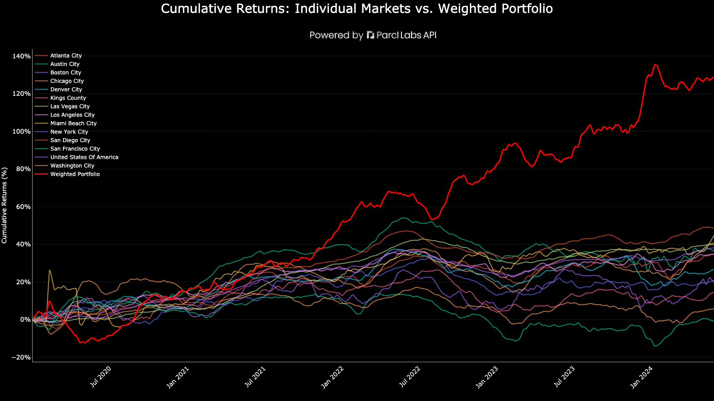

#### Seasonality Analysis
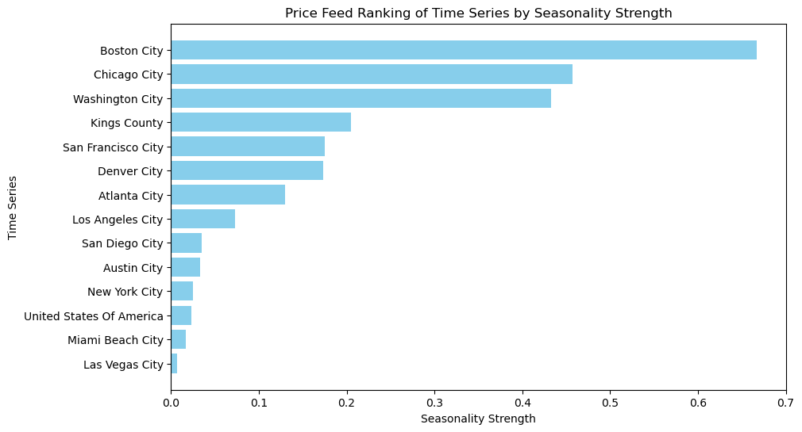

#### Cross ApEn Analysis
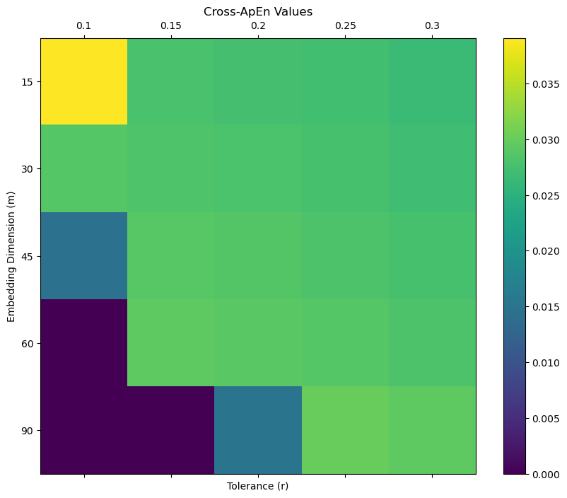

#### Correllation Analysis
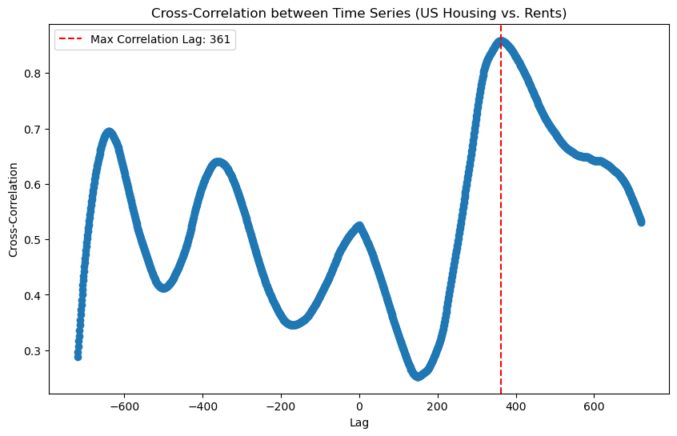
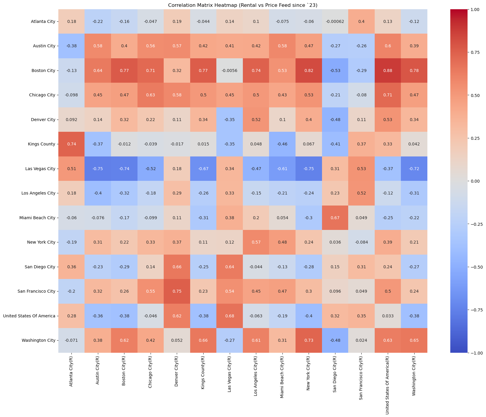

## Inspiration

We write all of our own content off of these notebooks. Here are some of the greatest hits: 

### [Institutional Activity Review Notebook](python/inspiration/investors/port_1000_plus_acq_disp.ipynb)

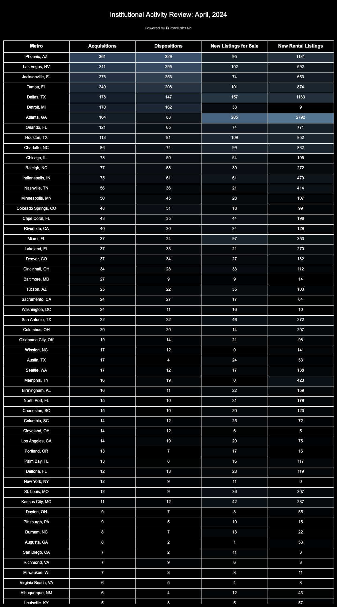

### [Market Supply and Demand Analysis Notebook](python/inspiration/supply_demand.ipynb)

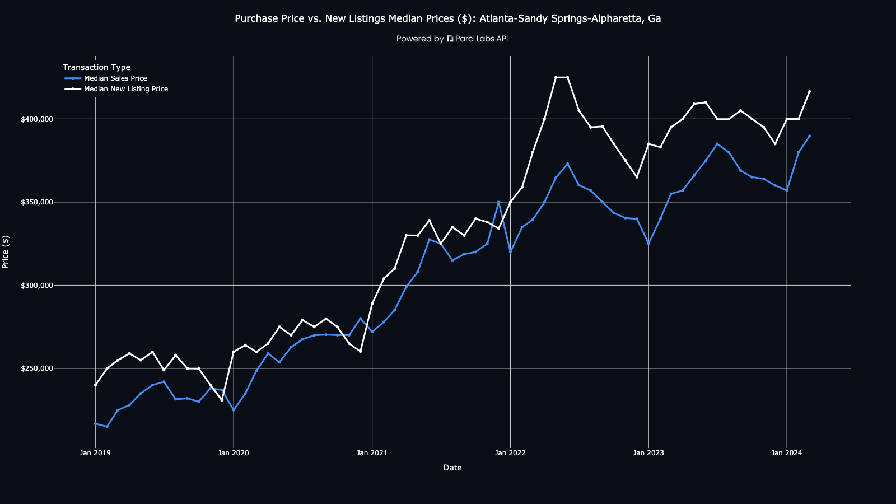

### [Investor Share of Resale Listings Notebook](python/inspiration/investor_share_of_resale_listings.ipynb)

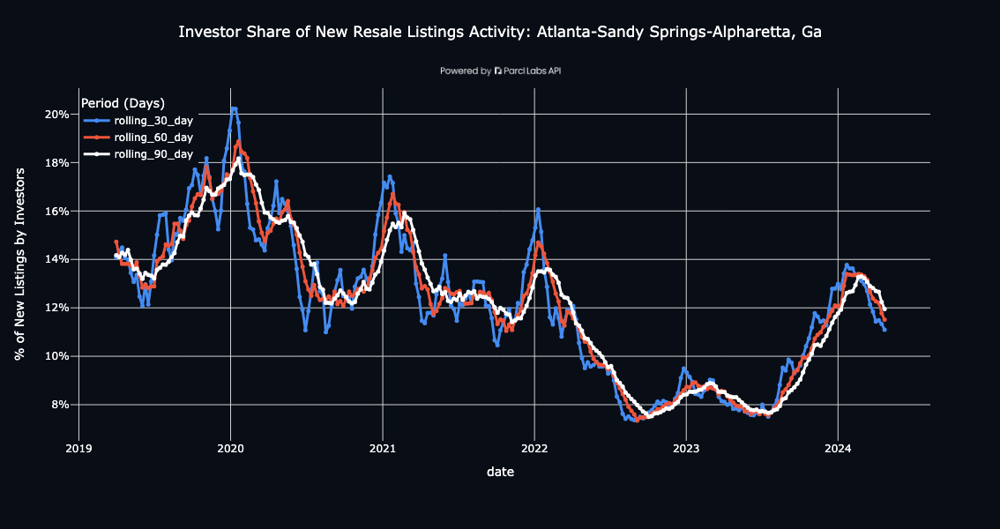

### [Map of where 1000+ unit portfolios own the most home, 3000+ counties notebook](python/inspiration/map_of_investor_ownership.ipynb)

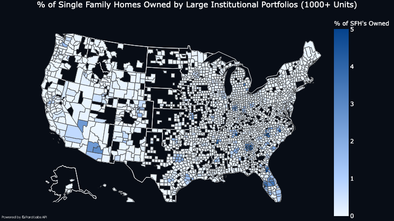

### [Deep dive market analysis notebook](python/inspiration/market_analysis.ipynb)

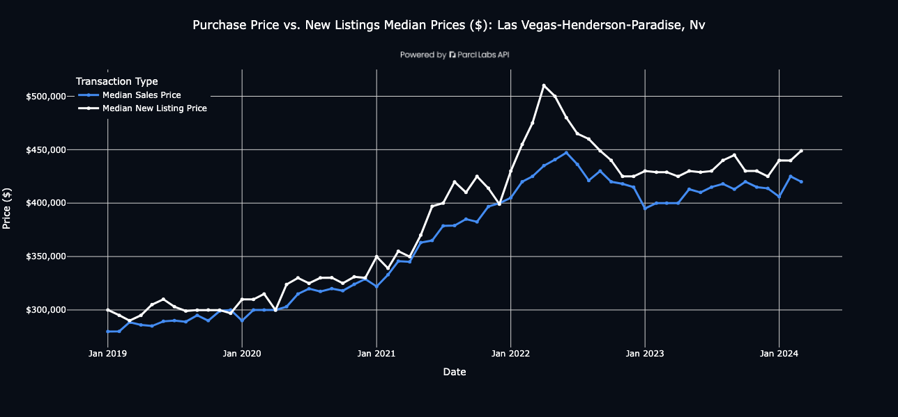

### [Map of where 1000+ unit portfolios own the most homes, in all zip codes in Georgia](python/inspiration/map_of_investor_ownership_zip_code.ipynb)
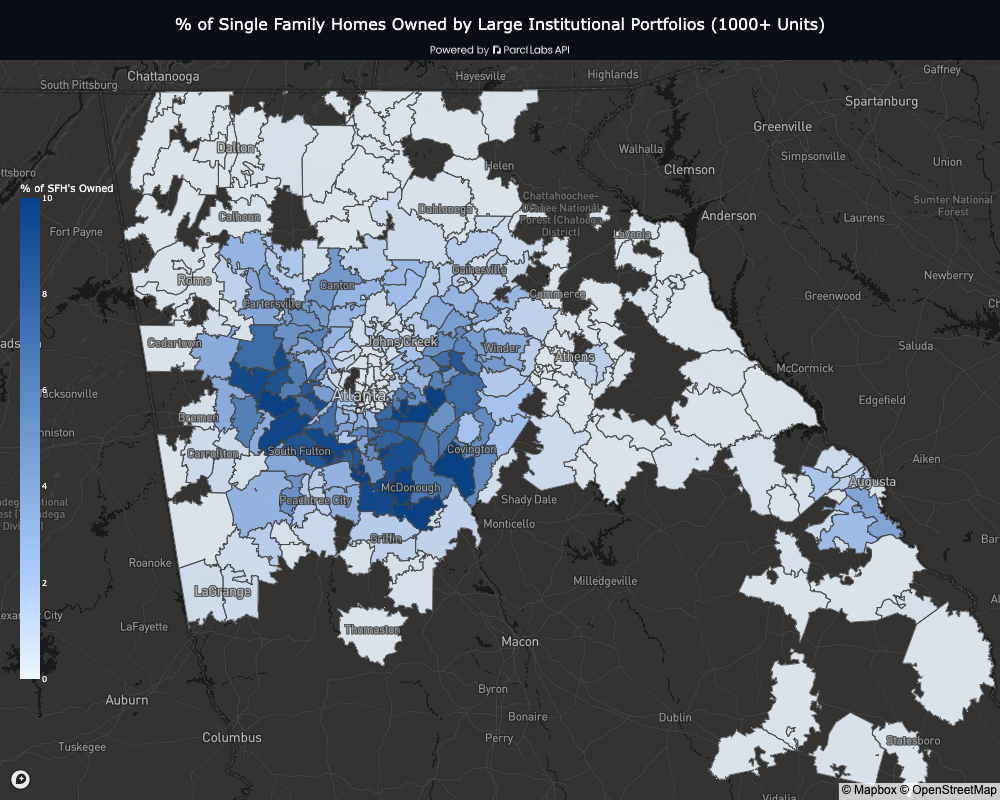

### [Which metros have the highest concentration of investor ownership notebook](python/inspiration/table_of_investor_concentration.ipynb)

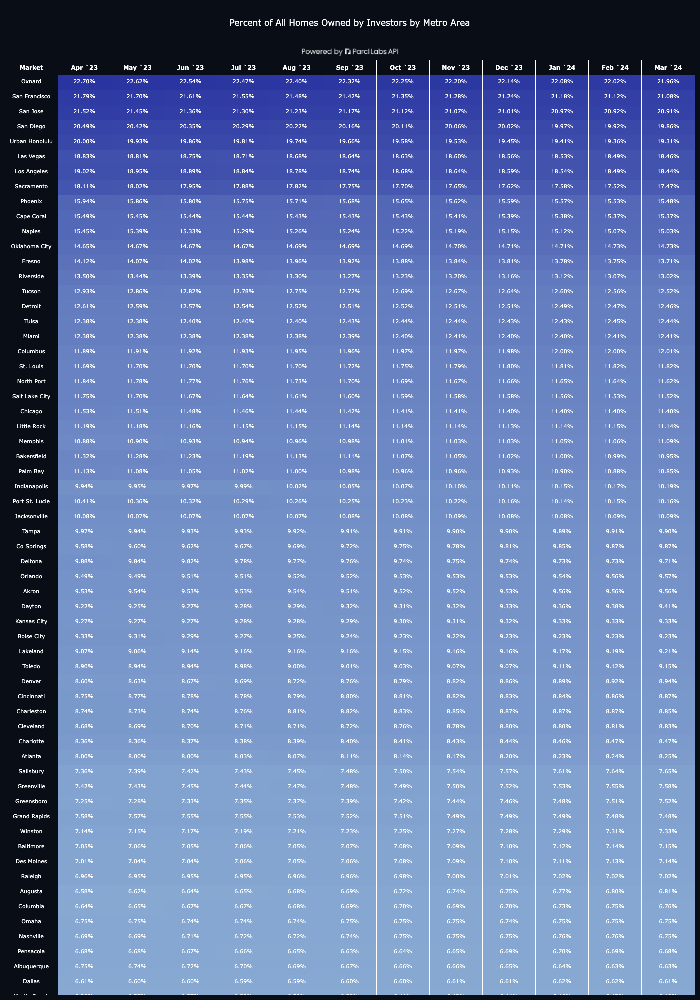

### [Are investor net buyers or sellers notebook?](python/inspiration/table_of_purchase_to_sale_ratio.ipynb)

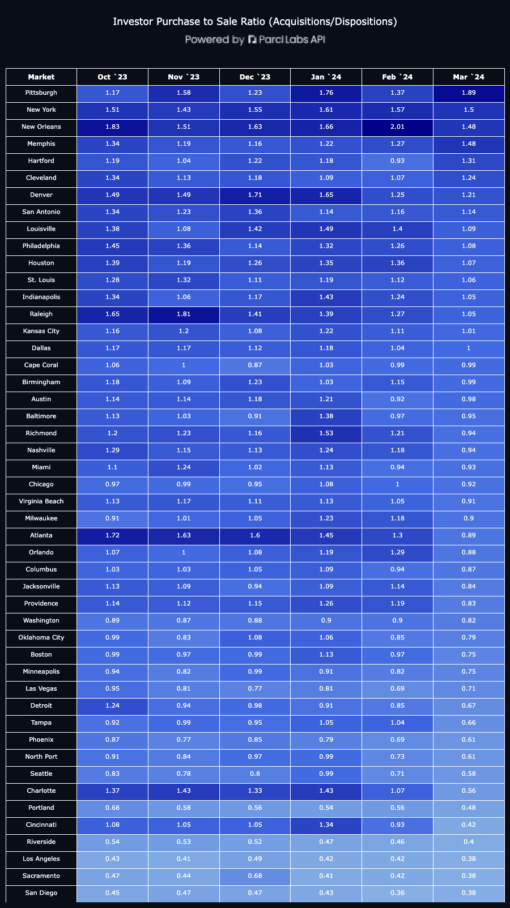

### [1000+ unit portfolio share of single family home resale listings market notebook](python/inspiration/large_institutional_impact_on_resale_market.ipynb)

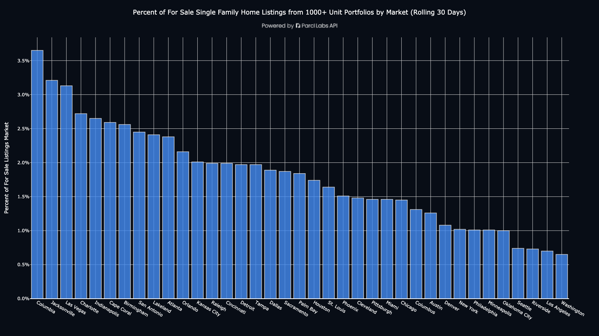

### [Gross Yield and Median Rental Price](python/inspiration/gross_yield_vs_rental_price.ipynb)

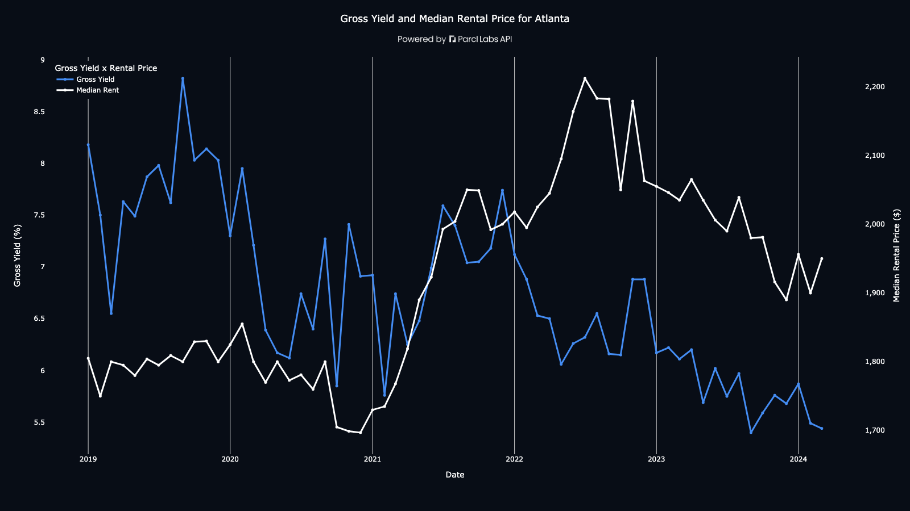

### [YoY Rental Price Changes for Every Zipcode Notebook](python/inspiration/map_of_yoy_rental_rates_by_zip.ipynb)

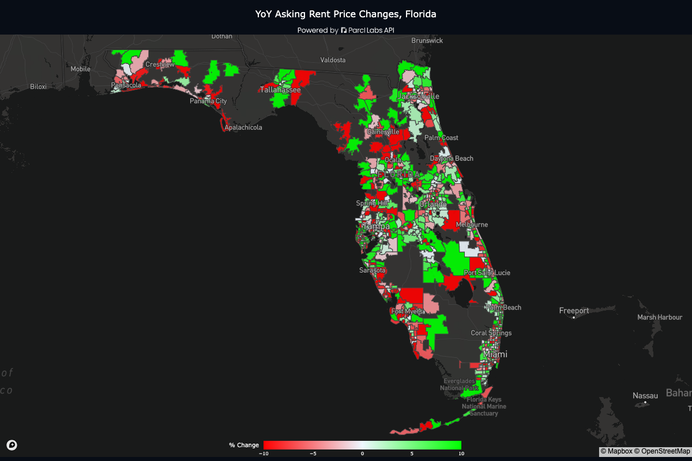

### [Which Metros Have the Highest Share of Mom and Pop Ownership? Institutional Ownership?](python/inspiration/table_of_mom_and_pop_vs_institutions_ownership.ipynb)

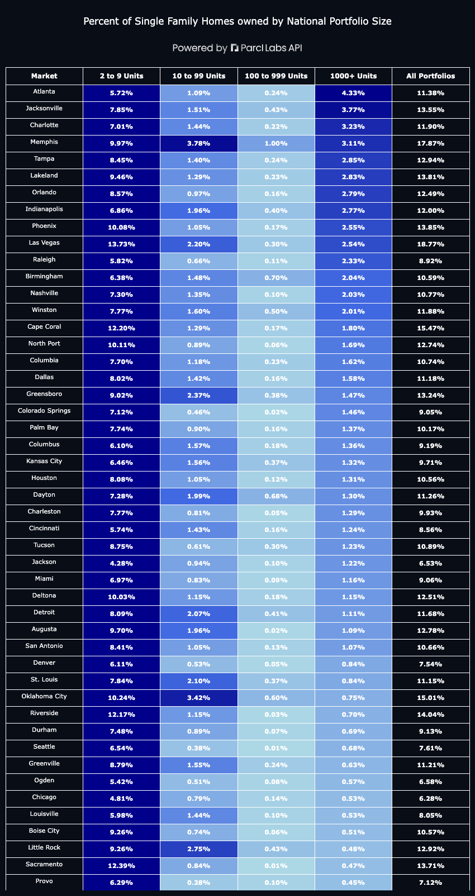


### [Single Family Home Rental Supply (30 Day Rolling) Notebook](python/inspiration/single_family_new_rental_listings_supply.ipynb)

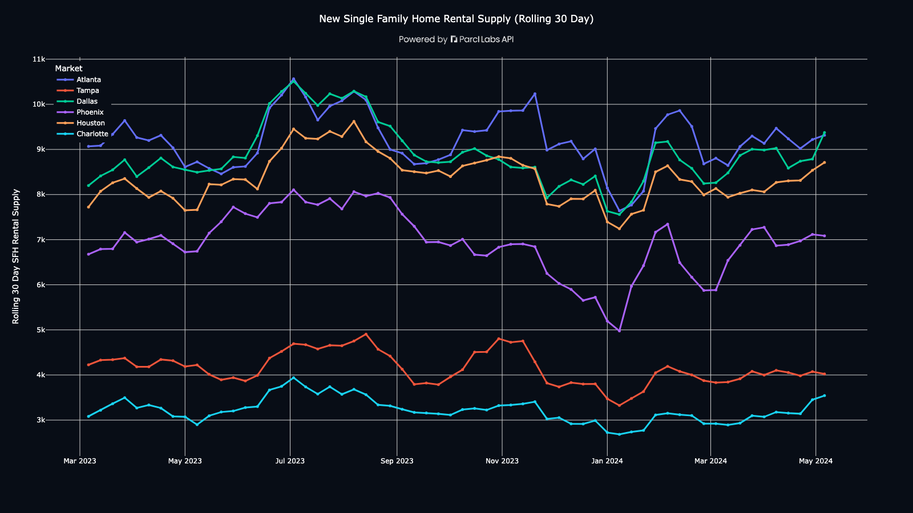