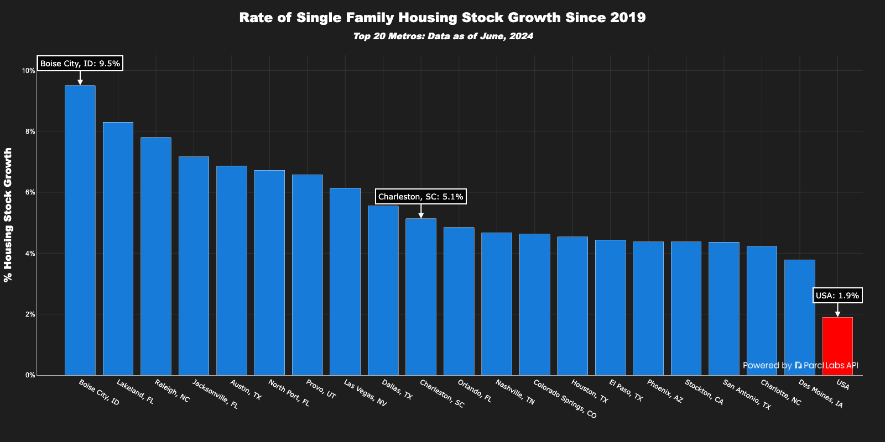
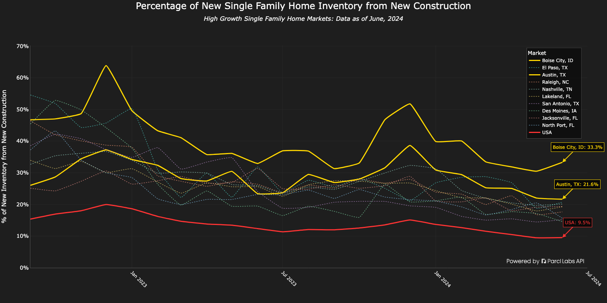
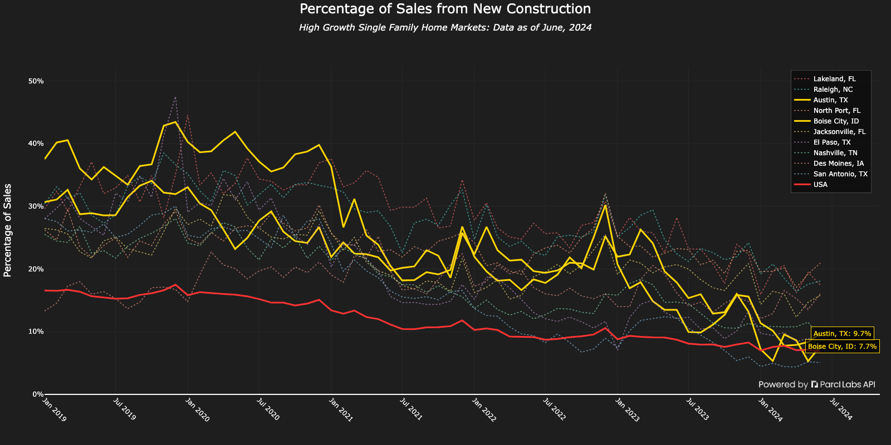
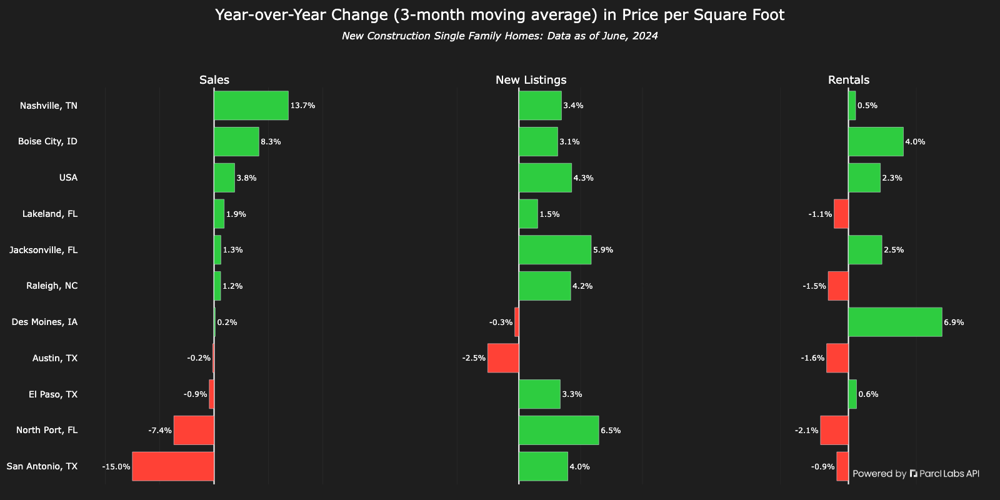
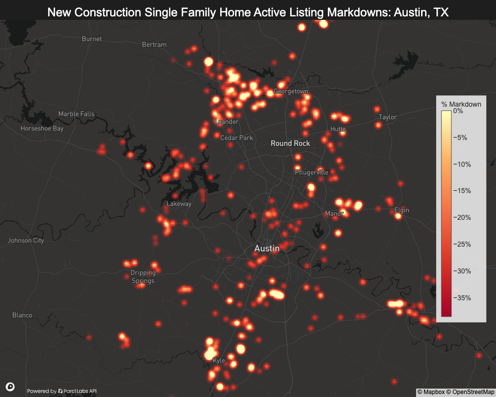
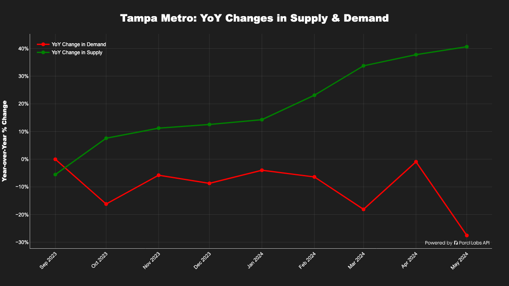
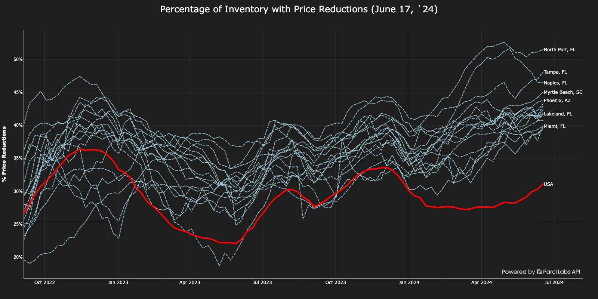
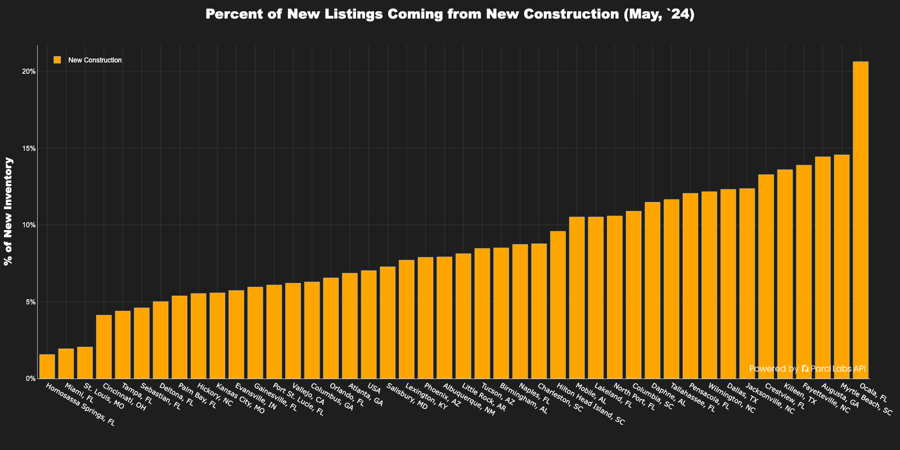

  

# Welcome to the Lab: Parcl Labs Cookbook

**We're on a mission to create the world's best API developer experience and community for housing data.** Our Cookbook open-sources our housing market research, empowering you to go from idea to analytics to insight.

The Cookbook repository provides ready-to-use code snippets and notebooks to help you easily use the Parcl Labs API for its top use cases: real estate trading and housing market analysis.

## Prerequisites

1. **Sign up for a free API key:** To use the examples in this repository, get a Parcl Labs API key [here](https://dashboard.parcllabs.com/signup).
2. **Review the API documentation:** Understand the data points, markets, and resources available. For help, check out these links:
    - [API developer documentation](https://docs.parcllabs.com/docs/introduction)
    - [Parcl Labs API community](https://docs.parcllabs.com/discuss)
    - [Parcl Labs SDK](https://github.com/ParclLabs/parcllabs-python)
3. **Set up to use example notebooks:** Use [Google Colab](https://colab.research.google.com/) for quick setup and execution, or run the code locally or your preferred environment. Google Colab is embedded in primary notebooks for easy use.

## Examples Repository Overview

Parcl Labs examples are categorized into three main sections:

1. [**Getting Started**](#getting-started): Introductory resources to help you navigate the Parcl Labs API, search markets, and download data into CSVs.
2. [**Housing Market Research**](#housing-market-research): Notebooks for analyzing the US housing market, including sales, listings, rentals, and investor trends.
3. [**Parcl Price Feed and Trader Resources:**](#parcl-price-feed-and-trader-resources) Resources for traders to leverage the Parcl Labs API, understand Parcl markets, access price feed time series, build models. 

For the brave, explore the **experimental folder** where the Parcl Labs team tests new ideas. See and contribute to ongoing projects.

## Getting Started

If you’re new to the Parcl Labs API, start here!: 

- [**Introduction to Search**](https://github.com/ParclLabs/parcllabs-cookbook/blob/main/examples/getting_started/search.ipynb): Learn how to get the unique `parcl_id` (market level identifiers) for the markets you want to analyze. This is a key concept that will help you understand how to pull market-level datapoints across the API.
- [**Data Downloader**](https://github.com/ParclLabs/parcllabs-cookbook/blob/main/examples/getting_started/download_data.ipynb): Download data across all Parcl Labs endpoints into a CSV. This is a great resource for users who want access to Parcl Labs data but may be less familiar with using an API.
- [**Bulk Data Downloader**](https://github.com/ParclLabs/parcllabs-cookbook/blob/main/examples/getting_started/bulk_data_download.ipynb): For upgraded API users, learn how to pull down thousands of markets across the country and load into a CSV or database. This is a great resource for users who want to analyze many markets at once.

## Housing Market Research

Parcl Labs produces and open sources cutting-edge research on the housing market. The intent of these notebooks is to make this type of analysis accessible to everyone, from curating datasets to generating user-friendly charts.

These notebooks fall into two subsections: **Supply and Demand** and **Investor Analytics**.

### Supply and Demand

_Inventory and Price Cut Analysis_

  

_New construction analysis_

  

  

  

  

  

  

*Notebooks:*

- [**Total Supply and Price Changes**:](https://github.com/ParclLabs/parcllabs-cookbook/blob/main/examples/housing_market_research/supply_and_demand/supply_and_price_changes.ipynb) Select a market and explore total supply changes and price changes over time.
- [**New Construction Trends**:](https://github.com/ParclLabs/parcllabs-cookbook/blob/main/examples/housing_market_research/supply_and_demand/new_construction_trends.ipynb) Select a market and explore new construction supply, demand, and pricing characteristics related to listings, sales, and rental prices.
- [**New Construction Trends (Advanced)**:](https://github.com/ParclLabs/parcllabs-cookbook/blob/main/examples/housing_market_research/supply_and_demand/new_construction_advanced_analytics.ipynb) Explore the current state of new construction market dynamics across the country.

### Investor Analytics

Analyze investor behavior, portfolio sizes, and their impact on the housing market.

*Notebooks:*

- [**Institutional Investor Acitivity**](https://github.com/ParclLabs/parcllabs-cookbook/blob/main/examples/housing_market_research/investor_analytics/institutional_activity.ipynb): Learn how to analyze what 1000+ portfolio owners, i.e. large institutional investors, are doing in the housing market.

## Parcl Price Feed and Trader Resources

Parcl Labs developed its [Parcl Price Feed](https://www.parcllabs.com/articles/parcl-labs-price-feed-whitepaper) to support the [Parcl](https://app.parcl.co) trading platform, enabling billions in trading volume. Price Feed data serves Parcl Traders and other applications by offering a real-time market indicator of U.S. and global housing market movements.

_Price Action and Sales Volume Technical Chart_

  

These resources range from core tasks like downloading price feed data to advanced charting.

*Notebooks:*

- [**Retrieve and Download Historical Price Feeds**](https://github.com/ParclLabs/parcllabs-cookbook/blob/main/examples/price_feed_trader_resources/download_sales_price_feed_data.ipynb): Learn how to retrieve all historical price feeds for markets currently tradeable on the Parcl Exchange. This is useful for backtesting and analyzing past market trends.
- [**Technical Price Feed and Volume Chart**](https://github.com/ParclLabs/parcllabs-cookbook/blob/main/examples/price_feed_trader_resources/trader_charts.ipynb): Create a financial chart that visualizes price feed action and and sales volume.

## Experimental
More advanced topics and ongoing projects are located in the experimental folder. These notebooks are for the curious and those looking to contribute to ongoing housing research.

_YoY Shifts in Supply and Demand Skew_

  

_YoY Shifts in Supply and Demand Skew for Many Markets_

  

_Inventory Price Cut Analysis Across Many Marketes_

  

_New Construction Impact on New Listings Coming to Market_

  

*Notebooks:*

- [**YoY Shifts in Supply and Demand for a Specific Market**](https://github.com/ParclLabs/parcllabs-cookbook/blob/main/examples/experimental/supply_and_demand/yoy_supply_changes.ipynb): Learn how to analyze YoY shifts in supply and demand for a given market
- [**Comprehensive US Housing Analysis Identifying Markets Setup for Price Declines**](https://github.com/ParclLabs/parcllabs-cookbook/blob/main/examples/experimental/supply_and_demand/markets_that_could_disrupt.ipynb): Analyze the entire US housing market and identifying markets that are poised for downward price pressure